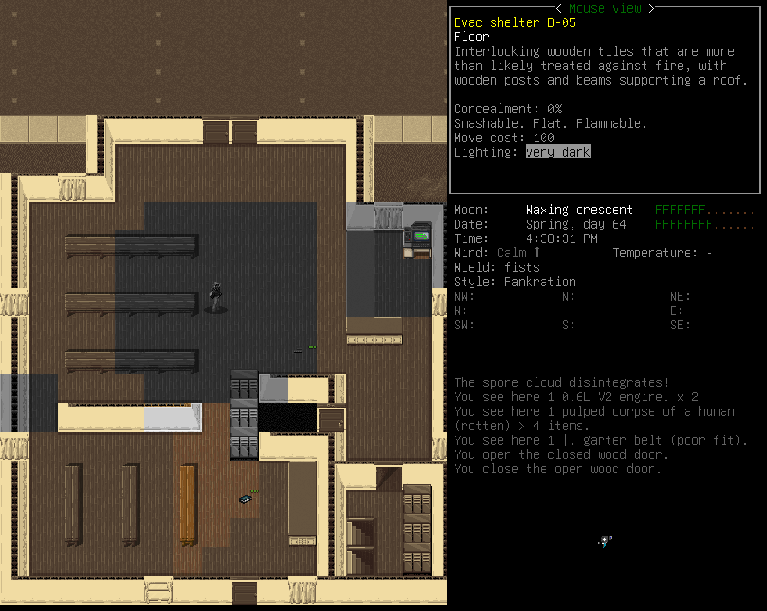
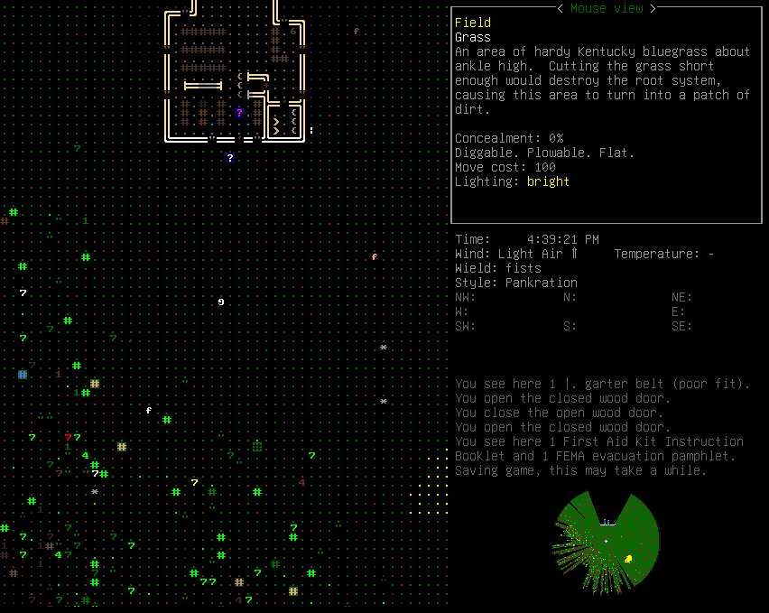

# ALO Ryhmätyö

Joel Myöhänen, Kaapo Mikkanen ja Toivo Juntunen

## Ohjelmiston Valinta:

Valitsimme projektiksimme “Cataclysm: Dark Days Ahead” pelin, joka on vapaalla lähdekoodilla GitHubissa.
Pelin tarkoitus on olla avoimen maailman selviytymisroolipeli.
Pelissä on roguelike elementtejä, eli kun hahmosi kuolee, alkaa peli alusta.
Koska pelin maailma kuitenkin generoidaan proseduraalisesti jokaisella pelikerralla, jokainen pelikerta on ainutlaatuinen. 

Ennen pelin aloitusta pelaajalla on mahdollisuus valita monesta eri skenaarioista, mikä lisää uudelleenpelattavuutta.
Pelissä on myös pelaajahahmolle monia eri ammatteja ja muita ominaisuuksia joista valita, mitkä vaikuttavat hahmon statseihin.
Pelaaja luo pelissä oman tarinansa ja tavoitteensa kullakin pelikerralla, joten peliä voidaan siinä mielessä luonnehtia sandbox tyyliseksi.

Ohjelmistoa käyttävät pelin pelaajat ja Cataclysm-DDA:n kehittäjät.
Pelin pelaajat pelaavat peliä ajankuluksi, ja koska se on hauskaa.
Kehittäjät voivat myös kehittää peliä huvin vuoksi, mutta osa tekijöistä saa kehittämisestä voittoakin sillä peli on steamissa myynnissä tällä hetkellä.
Lisäksi muiden pelien kehittäjät voivat hyötyä lähdekoodista, sillä siitä voi ottaa mallia jos tekee omaa pelimoottoria. 

## Lisenssi

Creative Commons Attribution-ShareAlike 3.0 Unported License

[http://creativecommons.org/licenses/by-sa/3.0/](http://creativecommons.org/licenses/by-sa/3.0/)

Ohjelmistoa voi käyttää, muokata ja jakaa (myös kaupallisesti) ehdoilla:

- Täytyy mainita alkuperäinen tekijä ja antaa linkki lisenssiin.
  Lisäksi täytyy mainita ollaanko tehty muutoksia.
  Muutokset eivät saa ehdottaa, että alkuperäinen tekijä hyväksyy muutokset. 
  
- Jos muutoksia ollaan tehty, täytyy muokattu ohjelmisto jakaa samalla lisenssillä kuin alkuperäinen. 

- Ohjelmistoon ei saa lisätä rajauksia mitä lisenssi ei salli. 

Osa repon koodista ei ole osa projektia, ja on eri lisensseillä.
Kaikki lisenssit löytyvät LICENCE.md tiedostosta. 

## Projektin Historia ja Aktiivisuus:

Projektin historia:

Peli on forkattu “Cataclysm” nimisestä avoimen lähdekoodin pelistä, jonka kehittäjä nimimerkiltään “Whales” julkaisi vuonna 2010.
Whales lopetti pelinsä kehittämisen vuonna 2012.
Cataclysm DDA:n kehittäminen aloitettiin vuonna 2013.
Merkittävä virstanpylväs pelin kehityksessä oli vuonna 2013 tehty kickstarter, jolla saatiin pelin kehitystä varten 9,492 dollaria.
Suositumpi peli jonka Cataclysm DDA on inspiroinut, on Project Zomboid, jonka mekaniikat ovat hyvin samanlaisia.
Voi jopa olla että Project Zomboidin kehittäjät ovat hyväksikäyttäneet Cataclysm-DDA:n lähdekoodia pelinsä kehityksessä.

Aktiivisuus:

Projektin master haaraa päivitetään useita kertoja päivässä.
Projektissa on yli 100 000 committia, ja pelkkä master haara vie tilaa yli 11GB!

Ylläpito:

Projektipäällikkö: KevinGranade

Projektissa on yli 2000 kehittäjää, joista tärkeimmät on mainittu pelin “Credits” kohdassa päävalikossa.

## Osallistuminen Projektiin:

Käytännössä kuka tahansa voi osallistua projektiin, osasi ohjelmoida tai ei
Se johtuu siitä, että peliin voi lisätä sisältöä pelkästään JSON tiedostojen avulla, mikä on helpompaa kuin C++:lla ohjelmointi
Ainoa eksplisiittinen rooli mitä projektissa näyttää olevan, on projektipäällikön rooli
Loput rooleista vaikuttavat siltä, että ne mukautuvat sen mukaan, mikä kiinnostaa ketäkin ja kukaa osaa mitäkin
Esimerkiksi joku saattaa tykätä pelkästään pelimoottorin optimisoinnista C++:lla, kun taas joku saattaa pelkästään kirjoittaa peliin tarinaa ja lisätä uusia esineitä tai vihollisia

Ohjeen mukaan projekti tulee forkata ja tehdä uusi branchi ja pull request, samaan tapaan kun tämän kurssin ekalla viikolla neuvottiin
Muuttaessa JSON tiedostoja, tekstieditorin täytyy olla sellainen, joka ei laita BOM kirjainta tiedoston alkuun
Esimerkiksi Notepad ei kävisi, kun taas Notepad++ käy
Jos kirjoittaa C++:lla uusia luokkia tai metodeita, olisi hyvä pistää Doxygen kommenteja jotta muut tekijät ymmärtäisivät mitä koodi tekee
Ennen pull requestin tekemistä olisi myös hyvä ajaa testit jotka sijaitsevat “tests/” kansiossa

## Tekninen Toteutus:

Itse pelimoottorin kielenä on C++, ja se käyttää SDL2 koodikirjastoa ääniin ja grafiikoihin
Peli käyttää datan tallentamiseen JSON tiedostoja, mikä tekee uuden sisällön lisäämisestä helppoa ei ohjelmoijille
JSON tiedostoissa on myös se etu, että ohjelmaa ei tarvitse kääntää uudestaan joka kerta kun niitä muokkaa
Projektissa testeihin käytetään “Catch2” testikirjastoa
Virallisten ohjeiden mukaan peli tulee kääntää makella, mutta sen voi myös kääntää CMakella halutessaan
Peli on portattu androidille javan ja gradlen avulla
Osa projektin työkaluista käyttää myös Python ja Bash

## Ohjelmiston Käyttöönotto:

Pelin voi asentaa joko terminaalipohjaisesti ncurses versiona, tai sitten SDL2 versiona joka sisältää äänet ja paremmat grafiikat
SDL2 versiota kutsutaan “tiles” versioksi
Peliin voi asentaa sellaisen tilesetin kuin haluaa, mikä vaikuttaa siihen minkälaiset grafiikat pelissä on
Lisäksi peliin voi asentaa erilaisia äänikokoelmia, mitkä vaikuttavat ääniefekteihin ja musiikkeihin

<https://github.com/CleverRaven/Cataclysm-DDA> (Päärepo)

<https://github.com/Fris0uman/CDDA-Soundpacks> (Äänikokoelmat)

<https://github.com/I-am-Erk/CDDA-Tilesets> (Tilesetit)

### Debian pohjaiset distrot (tiles versio)

1. Dependencyjen asennus `sudo apt-get install libsdl2-dev libsdl2-ttf-dev libsdl2-image-dev libsdl2-mixer-dev libfreetype6-dev build-essential`

2. Repon kloonaaminen `git clone https://github.com/CleverRaven/Cataclysm-DDA.git --single-branch`

3. Siirtyminen kansioon `cd Cataclysm-DDA`

4. Kääntäminen `make -j2 TILES=1 SOUND=1 RELEASE=1`

5. Pistä haluamasi äänikokoelmat kansioon `sound/`

6. Pistä haluamasi tilesetit kansioon `gfx/`

7. Pelin käynnistäminen `./cataclysm-tiles`

8. Valitse asetuksista haluamasi äänikokoelma ja tileset, ja käynnistä peli uudestaan.

9. Valmista tuli : )
