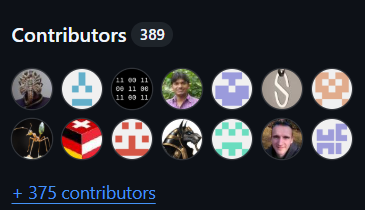
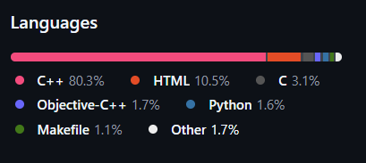
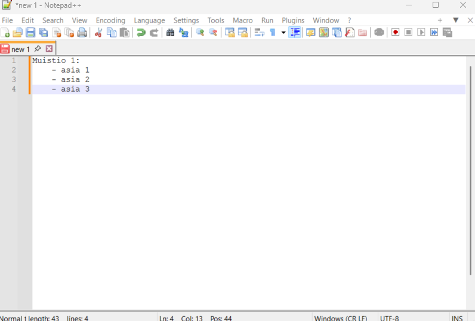

# Notepad++

## Ohjelma

**Nimi:** Notepad++

**Kuvaus:** Kevyt ja tehokas tekstieditori, joka tukee useita ohjelmointikieliä ja Markdownia.  

**Toimintaperiaate:** Notepad++ on tiedostopohjainen editori, joka avaa tekstitiedostoja, korostaa syntaksia, tarjoaa monia työkaluja kuten etsintä/korvaus, makrot ja pluginit, ja toimii Windows-ympäristössä ilman asennusta (portable-versio).  

**Käyttökohteet:**  
- Ohjelmointikielten koodin kirjoittaminen ja muokkaaminen (C++, Java, Python, HTML, CSS, JavaScript jne.)  
- Markdown-dokumenttien kirjoittaminen ja esikatselu  
- Kevyet tekstinkäsittelytehtävät  
- Logi- ja konfiguraatiotiedostojen muokkaaminen  
- Lyhyiden skriptien ja makrojen luominen

## Lisenssi

- GNU GENERAL PUBLIC LICENSE Version 3

**Ehdot:**
- Vapaa käyttö, muokkaaminen sallittu, uudelleenjakelu sallittu ilmaiseksi tai maksua vastaan
- Ohjelmaa jaettaessa lähdekoodi toimitettava mukana
- Muokatut versiot lisensoitava samalla lisenssillä (copyleft)
- Alkuperäiset tekijänoikeus- ja lisenssitekstit säilytettävä
- Muutokset ohjelmistoon merkittävä selkeästi

**Rajoitukset:**
- Jakelija ei saa rajoittaa GPL:n oikeuksia
- Ohjelmistopatentteja ei saa käyttää estämään lisenssin mukaisia oikeuksia
- Laitteissa ei saa estää käyttäjää asentamasta muokattua versiota, jos ohjelma toimitetaan laitteen mukana.

## Projektin historia 

Notepad++ perustettiin vuonna 2003 Don Ho:n toimesta Windowsille. Hän teki editorin, koska halusi kevyen ja monipuolisen tekstieditorin ohjelmointiin, joka olisi avoin lähdekoodiltaan ja helpompi käyttää kuin Windowsin oma Notepad. Ensimmäinen versio julkaistiin SourceForgessa, ja ohjelma on sen jälkeen kasvanut suosituimmaksi kevyeksi tekstieditoriksi.

- **2003:** Notepad++ perustettiin Don Ho:n toimesta ja julkaistiin ensimmäinen versio SourceForgessa.  
- **2011:** Lifehacker nimesi Notepad++ "The Best Programming Text Editor for Windows", ja kehui sen keveyttä ja monipuolisuutta, vaikka käyttöliittymä oli yksinkertainen.  
- **2014:** Lifehackerin lukijat valitsivat Notepad++ "Most Popular Text Editor" -äänestyksessä, 40 % 16 294 vastaajasta valitsi sen suosikkieditorikseen.  
- **2015:** Stack Overflow Developer Survey:ssa Notepad++ oli maailman käytetyin tekstieditori (34,7 % päivittäin käyttäjistä).  
- **2016:** Stack Overflow -kyselyssä Notepad++ oli edelleen suosittu (35,6 % käyttäjistä).  
- **2025:** Notepad++ joutui hyökkäyksen kohteeksi, kun haitalliset toimijat manipuloivat sen päivitystoimintoa (gup.exe). Ongelmasta selvittiin siirtämällä päivityspalvelin turvallisempaan ympäristöön ja vahvistamalla päivitysten varmennusmekanismia.

## Projektin Aktiivisuus

Notepad++ on edelleen aktiivisesti ylläpidetty projekti GitHubissa. Päivityksiä ja bugikorjauksia tehdään säännöllisesti, ja projektilla on suuri avoimen lähdekoodin yhteisö, joka osallistuu koodin kehittämiseen, issuesien ratkaisemiseen ja uusien ominaisuuksien lisäämiseen. Pääkehittäjänä toimii Don Ho yhdessä muiden aktiivisten kontribuoijien kanssa.

Notepad++ on edelleen aktiivisesti ylläpidetty projekti GitHubissa:

- Sillä on yli **27 000 tähteä** (stars), mikä kertoo suuresta suosiosta ja aktiivisesta käyttäjä‑ ja kehittäjäyhteisöstä.
- Repo on haarautunut (fork) yli **5 000 kertaa**, mikä osoittaa voimakasta kokeilua ja osallistumista. 
- Ihan viime aikoina repossa on ollut satoja **avoimia issueja (yli 2 800)** ja useita kymmeniä **avoimia pull requestejä**, mikä kertoo, että yhteisö tekee aktiivisesti korjauksia, päivityksiä ja parannuksia.  
- Projektin päähaaraan on kertynyt tuhansia commit‑muutoksia historian aikana (6 767 commitia 16.2.2026), ja viimeisin commit on tehty hyvin hiljattain.

Ylläpidosta vastaa nykyisin laaja avoimen lähdekoodin yhteisö, jotka yhdessä vastaavat bugikorjauksista, uusista ominaisuuksista ja projektin kehityksestä.

## Osallistuminen projektiin

- Erillistä lupaa osallistumiseen ei tarvitse pyytää
- Osallistuminen tapahtuu pääasiassa:
    -   Bugiraporttien tekemisellä
    -   Parannusehdotuksilla
    -   Koodimuutoksilla (pull request)
    -   Käännöksillä ja dokumentaatiolla

**Roolit:**
-   **Kehittäjät:**  
    - Tekevät bugikorjauksia, ominaisuuksia tai dokumentaatiota
    
-   **Projektin ylläpitäjät:**
    -   Hyväksyvät/hylkäävät pull requestit
    -   Hyväksyvät/hylkäävät ongelmia (issue)

**Muutosten tekeminen ja julkaisu:**
1) Luo ongelma (issue)
	- Pakollinen, jos kyse uudesta ominaisuudesta tai parannuksesta
	-  Hyväksytty ongelma saa hyväksytty-merkinnän (accepted) ennen jatkamista

2) Tee muutokset omassa haarassa (branch)
	- Luo uusi haara jokaista pull requestia varten
	- Haaran nimi tulee olla uniikki

3) Tee pull request
	- Yksi ominaisuus tai bugikorjaus per pull request
	- Luo pull request yhdellä commitilla
	- Perustetaan uusimpaan master-haaraan
	- Testaus tehtävä ennen lähettämistä

4) Ylläpito hyväksyy/hylkää muutokset

**Keskeiset työkalut:**
- Git & Github
	- Haarat
	- Pull requestit
	- Ongelmanseurantatyökalu (Issue tracker)

**Menettelytavat:**
- Koodaustyylinä puhdas koodi
- Pikkutarkat ohjeet koodaamiseen löytyvät Notepad++:n GitHub-repositorysta [contributing.md-tiedostosta](CONTRIBUTING.md)

## Tekninen toteutus

Notepad++ on pääosin kirjoitettu **C++-kielellä**, ja se hyödyntää **Win32 API:a** Windows-ympäristössä.  
Tekstieditorissa käytetään seuraavia välineitä ja teknologioita:

- **Kielet:** C++, hieman C

- **Kirjastot ja komponentit:** Scintilla-kirjasto (tekstin muokkaus ja syntaksikorostus), Win32 API, STL
- **Protokollat:** Ei varsinaista verkkoprotokollaa käyttöliittymässä, mutta päivitystoiminto käyttää HTTP/HTTPS-pyyntöjä Notepad++:n version tarkistukseen ja lataukseen
- **Työkalut ja ympäristöt:** Visual Studio tai muu C++ IDE Windowsille, GitHub versionhallintaan, GitHub Actions CI/CD-työkaluihin buildien ja testauksen automatisointiin
- **Lisäosat:** Plugin API mahdollistaa kolmansien osapuolten lisäosien (pluginien) käytön ja kehittämisen

Tämä tarkoittaa, että Notepad++:n muokkaaminen tai pluginien kehittäminen vaatii **C++-osaamista, Windows-ohjelmointitaitoja ja Git-versionhallinnan tuntemusta**.

## Ohjelmiston käyttöönotto

1. Asenna tarvittavat työkalut
	- Microsoft Visual Studio 2022 version 17.5 (C/C++ Compiler, v143 toolset for win32, x64, arm64)
2. Kloonaa Notepad++ repository Visual Studiossa
3. Avaa projekti
	- Avaa koko ratkaisun (solution) build-tiedosto (notepadPlus.sln)
4. Valitse build-asetukset
	- Configuration: Debug tai Release
	- Platform: x64 / Win32 / ARM64
5. Käännä projekti
	- Valitse build
	- Tämä kääntää automaattisesti tarvittavat kirjastot:
		-   notepad++.exe
		-   libScintilla.lib
		-   libLexilla.lib
6. Ohjelmisto on valmis käytettäväksi

- Notepad++:n GitHub-repositorysta löytyy alkuperäiset [asennusohjeet](BUILD.md)

