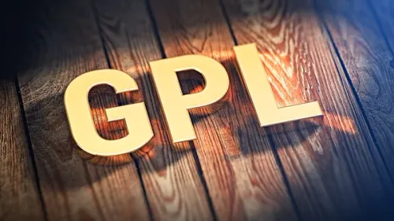

# OpenTTD

OpenTTD on yksi tunnetuimmista ja pitkäikäisimmistä avoimen lähdekooddin peliprojekteista. OpenTTD on moderni simulaatiopeli, joka perustuu klassiseen vuoden 1994 *Transport Tycoon Deluxe* - peliin.

## Ohjelmiston valinta

### Mikä OpenTTD?
**OpenTTD** on simulaatiopeli, jossa toimit kuljetusyrityksen johtajana. Pelin pääasiallinen tarkoitus on rakentaa ja hallinnoida kattavaa kuljetusverkostoa ja varmistaa, että matkustajat ja rahti liikkuvat tehokkaasti paikasta toiseen. 

### Miten ohjelmisto toimii?
Peli toimii **[ruutupohjaisessa ympäristössä](https://en.wikipedia.org/wiki/Isometric_video_game)**, jossa pelaaja:
- Rakentaa infrastruktuuria (kuten rautateitä, asemia ja teitä).
- Ostaa ja aikatauluttaa kulkuneuvoja.
- Kilpailee pelin omaa tekoälyä tai muita pelaajia vastaan markkinaosuuksista.

### Missä tilanteissa käytetään?
OpenTTD toimii ensisijaisesti **viihdekäytössä**, mutta se on peli, joten sitä voi hyödyntää myös:
- Oppimisympäristönä logistiikan, resurssienhallinnan ja infrastruktuurin suunnittelun perusteisiin.
- Yhteisöllisyyden ja verkostoitumisen apuvälineenä

---

## Lisenssi: **[GNU General Public License](https://github.com/OpenTTD/OpenTTD?tab=License-1-ov-file#readme)**
OpenTTD on julkaistu GPL-lisenssillä, joka perustuu ajatukseen ajatukseen ohjelmiston neljästä perusvapaudesta, jotka ovat **Vapaus käyttää, tutkia, jakaa ja muokata ohjelmaa**

### Ehdot
GPL-lisenssin ehdot suojaavat käyttäjän oikeuksia ja varmistavat projektin jatkuvuuden:
- **Lähdekoodin avoimuus** 
    - Jos jakaa ohjelmistoa eteenpäin, on annettava pääsy lähdekooddiin kokonaisuudessaan.
- **Copyleft-periaate**
    - GPL lisenssin tärkein ehto: jos tekee muutoksia koodiin ja julkaisee ne, myös näiden muutosten on oltava GPL-lisenssin alaisia. Tämä ehto estää koodin tietynlaisen omimisen suljetuksi ohjelmistoksi.
- **Muutosten dokumentointi**
    - Jos muokkaa tiedostoja, on niihin lisättävä maninta tehdyistä muutoksista ja päivämäärästä.
- **Alkuperäisten tekijöiden kunnioittaminen**
    - Kaikki alkuperäiset tekijänoikeusilmoitukset ja lisenssitekstit on säilytettävä koodissa.

### Rajoitukset
GPL-lisenssin rajoitukset on suunniteltu estämään ohjelmiston muuttaminen suljetuksi:
- **Ei suljettua kaupallistamista**
    - Ohjelmiston koodia ei saa ottaa niin, että siihen lisätään omia ominaisuuksia ja myydään eteenpäin suljettuna tuotteena, jonka lähdekoodi on piilossa.
- **Vastuuvapaus**
    - Ohjelmisto tarjotaan sellaisena kuin se on eivätkä tekijät ole vastuussa mahdollisista vahingoista tai virheistä, joita ohjelmiston käyttö saattaa aiheuttaa.
- **Lisenssin muuttaminen**
    - Ohjelmiston lisenssiä ei voi muuttaa kaupalliseksi tai sellaiseksi, joka rajoittaa muiden oikeuksia käyttää koodia.
- **Yhteensopivuus muiden lisenssien kanssa**
    - GPL-koodia ei voida yhdistää sellaiseen koodiin, jonka lisenssi kieltää lähdekoodin jakamisen.
