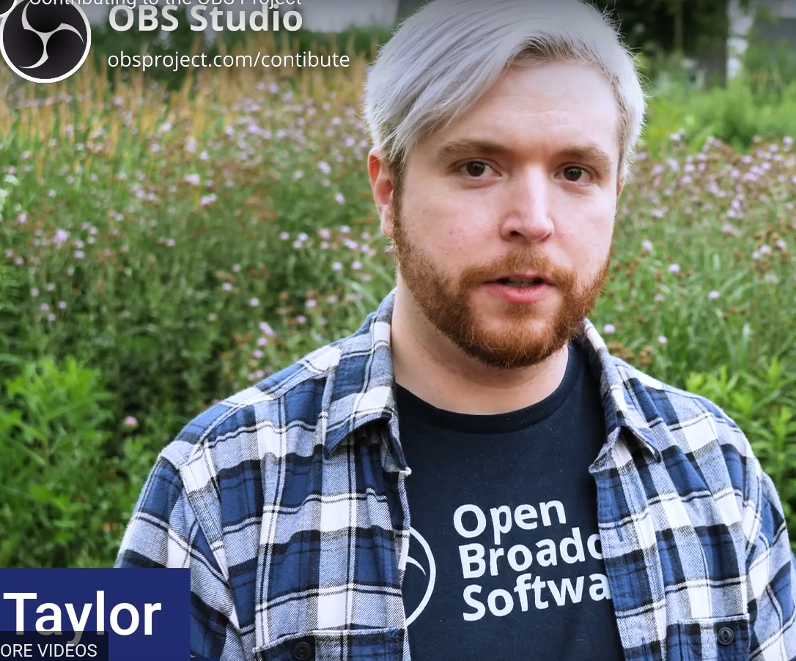

## OBS Studio

### Ohjelma
- **Nimi:** OBS Studio
- **Kuvaus:** Videotuotanto-ohjelmisto
- **Toimintaperiaate:** Kyseinen C:llä ja C++:lla kirjoitettu ohjelmisto ottaa videoita syötteenä ja prosessoi eri lähteistä reaaliajassa toivotun videomuotoisen lopputuotteen
- **Käyttökohteet:** Suurimmat käyttäjäkunnat on verkkopalveluihin suoratoistovideoita tuottavat henkilöt ja erityisesti pienet organisaatiot, sekä ammatti että harrastekäytössä.

### Lisenssi
- **Lisenssi:** GPL 2.0
- **Tiivistelmä:** Projektia saa käyttää varsin vapaasti kuten haluaa kunhan lisenssin säilyttää ja binäärin haltuun saaneille tarjotaan pääsy lähdekoodiin.

### Projektin Aktiivisuus ja Ylläpito
- **Historia:** Projekti perustettu vuonna 2012 ja siirretty Githubiin 2014. Vuonna 2016 projekti uudelleenimettiin OBS Studioksi. Vuonna 2021 Streamlabs yritti väärinkäyttää OBS -tavaramerkkiä sekä lähdekoodia
- **Aktiivisuus:** Päivityksiä julkaistaan karkeasti kuukausittain
- **Ylläpito:** Projektin myötävaikuttajat, sekä taloudelliset tukijat

### Osallistuminen Projektiin
- **Contribution Model:** Projektissa on ydintiimi, jolla on nimi Lain. Se vastaa koodin laadun arvioinnista. Muutoin projektiin voi kontribuoida kuka vain. Käännöstiimi on erikseen.
- **Osallistumisen Menettelytavat:** Github issuet ja pull requestit. Koodille on laatuohjeet.

### Tekninen Toteutus
- **Kielet:** C, C++
- **Protokollat:** RTMP, OBS WebSocket
- **Välineet:** QT

### Projekti Käyntiin
- **Asennus ja Käyttöönotto:** Projektia jaetaan valmiina binäärinä. Projektin kääntämiseen lähdekoodista on cmake automaatio ja käyttöohjeet täällä: https://github.com/obsproject/obs-studio/wiki/build-instructions-for-linux 

*Generated using BIGBRAINS-3.6*
